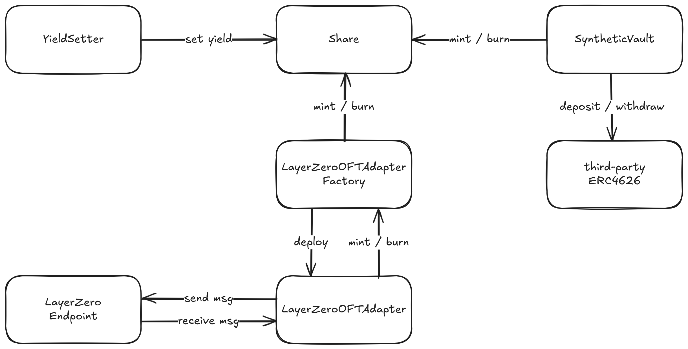

# Citrus Stable

> Omnichain yield bearing stables.


## Description

This projects aims to create many different omnichain yield bearing stables. Our main one one is ciUSD which is backed by major USD stablecoins, but there are many more like ciBTC, ciETH, ciEUR, etc. Anyone can mint and redeem these stables from trusted protocols, those can then be transferred freely to other chains thanks to our zero-config LayerZero integration. Users can choose to earn yields without losing ownership of their tokens.




## Installation

- [Install Foundry](https://getfoundry.sh/introduction/installation)
- Install dependencies: `forge install`


## Usage

### Build

```shell
$ forge build
```

### Test

```shell
$ forge test
```


## Security considerations

- Yield Setter is controlled by a EOA and could bankrupt the protocol by setting an unreasonable high yield
  - We have a max yield controlled by the owner (Multisig)
- Our OFT Adapter does not requires to be setup and instead relies on peer addresses to be computable. If deployed improperly, a share could represent one asset on one chain and another asset on another chain, and allow users to transfer a lower value asset for a higher value one.
  - Deployments are required to be done using CREATE2
- Our OFT Adapter being zero-config, multiple endpoints are setup by default on a chain while only one is the correct one.
  - Unless LayerZero become malicious, this should not be a problem
- Peg difference between assets can cause the cheaper asset to be the only backing asset as arbitrageurs can "swap" tokens at a 1:1 rate
  - For small but long lasting peg differences, the manager can add deposit and withdraw fees so that arbitrage is no longer profitable
  - There is no solution for huge peg differences, the backing assets should be vetted and riskier assets should be setup using a lower deposit cap


## Inspiration

[Origin Protocol](https://www.originprotocol.com/): While little to no code was used from this project, their work was a huge inspiration for this project.

